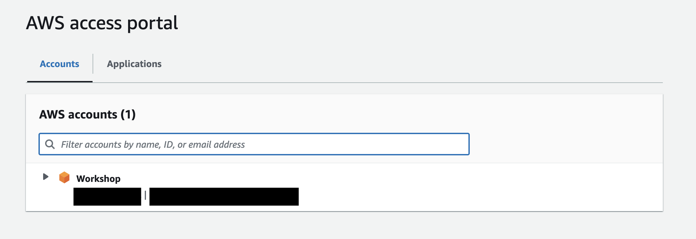
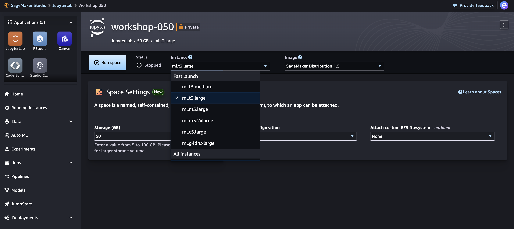
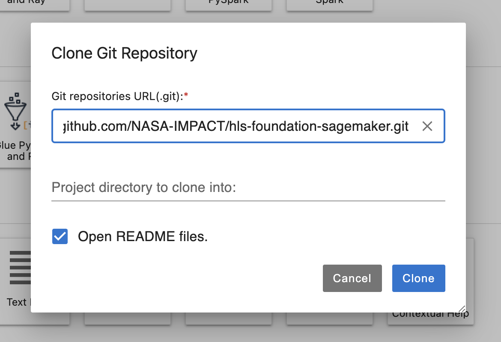

## Prerequisites

### High Performance Computing access

### Resources
1. https://judoor.fz-juelich.de/
2. https://nasa-impact.awsapps.com/start/
3. 

### Cloud environment access
1. Get your credentials and other information using https://creds-workshop.nasa-impact.net/


2. Navigate to https://nasa-impact.awsapps.com/start#/ 

3. Log in using the credential provided

4. Navigate to the `Applications` tab

5. Click and open `Amazon SageMaker Studio`

6. Once the Studio starts, Click on JupyterLab


7. Click `Create JupyterLab Space`

8. Give it a name. Eg: `Workshop`
9. Once initialized, change Instance type to `ml.t3.large` and storage to `50`

10. Click on `Run Space`. If it throws an error, you might have to pick an Image. The top setting called `Latest` works. 


## HLS fine-tuning
Harmonized Landsat and Sentinel - 2 (HLS) Foundation model (Prithvi) is currently available in Huggingface(https://huggingface.co/ibm-nasa-geospatial/Prithvi-100M). In this hands-on, finetuning will be done in the Julich Supercomputing Center (JSC). Please follow instructions listed in the [notebook](../HLS-finetuning/notebooks/hls-fm-finteuning.ipynb).

**Note: Before we start, please clone this repository in the JSC notebook environment.**

### Prepare Environment for Fine-tuning
 Clone this repository `git clone https://github.com/nasa-impact/HDCRS-school-2024.git`
```
a. Click `git`
b. Click on `Git Clone Repo`

c. Paste `https://github.com/nasa-impact/HDCRS-school-2024.git` and Click on `Clone`.


```

