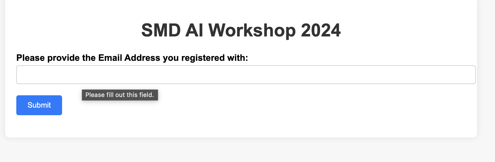
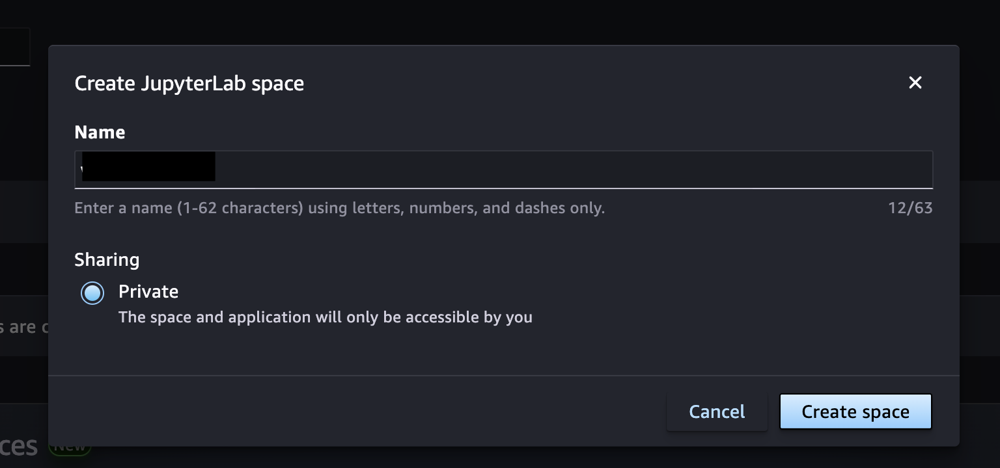
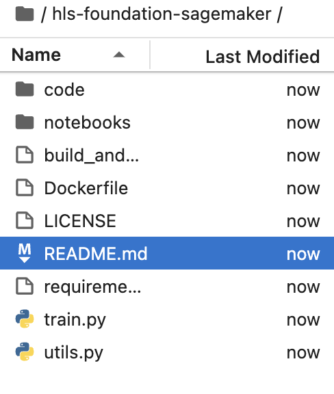

## Prerequisites

### High Performance Computing (HPC) access
**Source: [User access](https://gist.github.com/stemauro/aca1e5339babe664169ac7126b2801ce)**
These guidelines refer to the following notes from a different course: https://zhukov1.pages.jsc.fz-juelich.de/intro2sc-handson/docs/access. Please note that the training project for this course is different (training2411). See below in this document for more details.

Instructions to accomplish the following steps are explained in detail within different sections/subsections of the above notes. Please, refer to the section/subsection whose title is `<TITLE>` whenever you get to any of the following bullet point stating "*follow section/subsection `<TITLE>`*".

- Join a compute time project on JuDoor:
    - use link: https://judoor.fz-juelich.de/projects/training2411/
    - you will have to sign the Usage Agreement for each resource ([video](https://drive.google.com/file/d/1mEN1GmWyGFp75uMIi4d6Tpek2NC_X8eY/view))
- Access the system by:
    - generating a key pair with *OpenSSH*:
        - follow subsection [Generating a key pair with OpenSSH](https://zhukov1.pages.jsc.fz-juelich.de/intro2sc-handson/docs/access/#generating-a-key-pair-with-openssh)
    - uploading the key to JuDoor
        - you will need to find your IP(v4) address (try [here](https://www.whatismyip.com/)) and tweak it, namely
        - if your IP address is `93.199.55.163`, then turn it into `93.199.0.0/16,10.0.0.0/8`
        - follow subsection [Uploading the public key](https://zhukov1.pages.jsc.fz-juelich.de/intro2sc-handson/docs/access/#uploading-the-public-key) using your tweaked IP address
        - repeat the process for every resource listed under "Budget `training2411`" 

- Log in to the system via [Jupyter-JSC](https://jupyter.jsc.fz-juelich.de/hub/login):
     - if this is your first time using Jupyter-JSC you will have to register your JuDoor account
     - you will receive a request for account confirmation to the email address associated with your JuDoor account
     - follow subsection [JupyterLab](https://zhukov1.pages.jsc.fz-juelich.de/intro2sc-handson/docs/access/#jupyterlab)
     - create a new notebook using the following configutation values 

#### Setup HPC environment:

Please read through the details in the [Readme](../sc_venv_template/readme.md) to understand and setup the HPC environment for our hands-on session.

### Resources
1. https://judoor.fz-juelich.de/
2. https://nasa-impact.awsapps.com/start/
3. 

### Cloud environment access
1. Get your credentials and other information using https://creds-workshop.nasa-impact.net/


2. Navigate to https://nasa-impact.awsapps.com/start#/ 

3. Log in using the credential provided

4. Navigate to the `Applications` tab

5. Click and open `Amazon SageMaker Studio`

6. Once the Studio starts, Click on JupyterLab


7. Click `Create JupyterLab Space`

8. Give it a name. Eg: `Workshop`
9. Once initialized, change Instance type to `ml.t3.large` and storage to `50`

10. Click on `Run Space`. If it throws an error, you might have to pick an Image. The top setting called `Latest` works. 


## HLS fine-tuning
Harmonized Landsat and Sentinel - 2 (HLS) Foundation model (Prithvi) is currently available in Huggingface(https://huggingface.co/ibm-nasa-geospatial/Prithvi-100M). In this hands-on, finetuning will be done in the Julich Supercomputing Center (JSC). Please follow instructions listed in the [notebook](../HLS-finetuning/notebooks/hls-fm-finetuning.ipynb).

**Note: Before we start, please clone this repository in the JSC notebook environment.**

### Prepare Environment for Fine-tuning
 Clone this repository `git clone https://github.com/nasa-impact/HDCRS-school-2024.git`
```
a. Click `git`
b. Click on `Git Clone Repo`

c. Paste `https://github.com/nasa-impact/HDCRS-school-2024.git` and Click on `Clone`.


```
